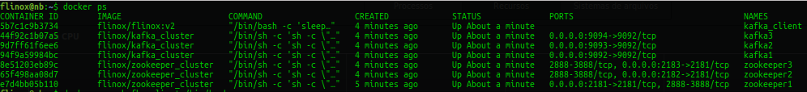
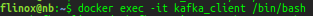
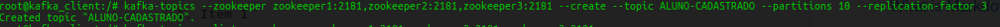
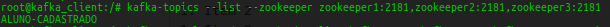
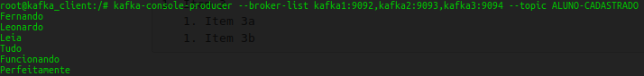
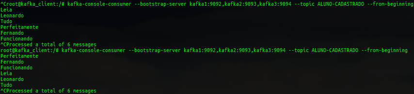
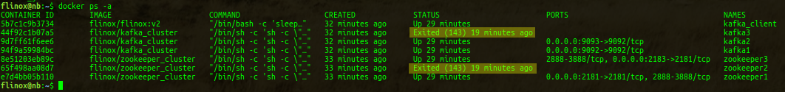
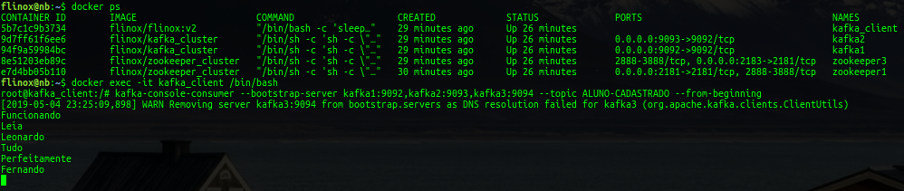

# KAFKA CLUSTER

A simple kafka cluster to give you an ideia, how it works.
I'm learning too, so if you found an error or have a suggestion to change, please let me know... email: <fernandolinox@gmail.com> or on [Linkedin Flinox](https://www.linkedin.com/in/flinox/)

I test and everything is working, very tolerant a failures, it's amazing !!

So, you just need to type: 
```
docker-compose up
```

And... good to go !

Maybe you need to tunning parameters, configurations, setting persistent volumes... and so on... but, this code will give you a good ideia to work with a kafka cluster.

## What is Kafka ?

Apache Kafka® is a distributed streaming platform. What exactly does that mean?

A streaming platform has three key capabilities:

    Publish and subscribe to streams of records, similar to a message queue or enterprise messaging system.
    Store streams of records in a fault-tolerant durable way.
    Process streams of records as they occur. 

Kafka is generally used for two broad classes of applications:

    Building real-time streaming data pipelines that reliably get data between systems or applications
    Building real-time streaming applications that transform or react to the streams of data 


More informations on: [Apache Kafka Introduction](https://kafka.apache.org/intro)


## Pre-reqs

You need to know and have Docker on the machine.

The owner of the volumes must have the UID 1000, or you need to change the UID and GID on respectives kafka/Dockerfile and zookeeper/Dockerfile.

The folders you need to create and set the correct ownership are:

```
kafka/config
kafka/log

zookeeper/conf
zookeeper/data
zookeeper/log
```

Where kafka/config is the configuration folder for every node of kafka.
Where zookeeper/conf is the configuration folder who is shared for every node of zookeeper, you can create conf isolated for zookeeper if you want.

Is very important before you run and use your cluster, you need to configure a persistent volumes for store the data:

```
zookeeper/data
```
And maybe another for logs
```
zookeeper/log
kafka/log
```

Build the dockerfile to create an image of zookeeper and another for kafka on your dockerhub account, remember to change the image reference on docker-compose.yml, to build the images run something like:

```
cd ~/github.com/flinox/kafka_cluster/zookeeper
docker build -t flinox/zookeeper_cluster .

cd ~/github.com/flinox/kafka_cluster/kafka
docker build -t flinox/kafka_cluster .
```

Or, you can uncomment the "build" on docker-compose.yml, but the start will take much more time, for example:
```
.
services:

  zookeeper1:
    build: ./zookeeper/
    #image: flinox/zookeeper_cluster
.
```

Initialy the zookeeper and kafka are not safety, because I'm using on zookeeper image the ALLOW_ANONYMOUS_LOGIN: "yes", but if you expect use this in production I recomend you turn off this variable and study how to turn it safe for production ( I will soon ).

## Run the cluster

After configure, to run the container inside your AWS cloud or your onpremises server, just run:

```
docker-compose up
```

You will start 3 zookeeper and 3 kafka brokers.

## To evolve

### Another zookeeper node

Just add on your docker-compose.yml another service, for example:
```
  zookeeper4:
    image: flinox/zookeeper_cluster
    user: "1000:1000"
    hostname: zookeeper4
    container_name: zookeeper4
    networks:
      - cluster-net
    volumes:
      - ./zookeeper/data/zookeeper4:/data/zookeeper
      - ./zookeeper/log/zookeeper4:/opt/zookeeper/log
      - ./zookeeper/conf:/opt/zookeeper/conf
    ports:
      - "2181:2181"
    environment:
      ALLOW_ANONYMOUS_LOGIN: "yes"
      ID: 4
```
Every new node will automatically update the zookeeper/conf/zoo.cfg with the ip of new node.

### Another kafka node

Just add on your docker-compose.yml another service, for example:
```
  kafka4:
    image: flinox/kafka_cluster
    user: "1000:1000"    
    hostname: kafka4
    container_name: kafka4
    networks:
      - cluster-net
    volumes:
      - ./kafka/log/kafka4:/opt/kafka/logs
      - ./kafka/config/kafka4:/opt/kafka/config
    ports:
      - "9092:9092"
    environment:
      ID: 4
      ALLOW_PLAINTEXT_LISTENER: "yes"
```

Before run, make a copy of folder:
```
kafka/config/kafka1
to
kafka/config/kafka4
```

Change the file server.properties :
```
# The broker.id is automatically updated by start.sh script, but you can set the value of your new node
# in our example is 4
broker.id=4

# If you have zookeeper nodes you need to include on this parameter
# I will work on create a script to do this soon
zookeeper.connect=zookeeper1:2181,zookeeper2:2181,zookeeper3:2181
```

I will work soon to make a script to easly make this, and maybe use docker-compose scale, but i need more time lol...


### If you don't want to use docker-compose, you can run individualy, something like this:

```
cd ~/github.com/flinox/kafka_cluster/zookeeper

export ID=1

docker run --rm \
--name zookeeper${ID} --hostname zookeeper${ID} \
-u 1000:1000 -e ID=${ID} \
-v $(pwd)/data/zookeeper${ID}/:/data/zookeeper \
-v $(pwd)/log/zookeeper${ID}/:/opt/zookeeper/log \
-v $(pwd)/conf/:/opt/zookeeper/conf \
flinox/zookeeper_cluster
```

## Adding another zookeeper node on cluster

```
export ID=2

docker run --rm \
--name zookeeper${ID} --hostname zookeeper${ID} \
-u 1000:1000 -e ID=${ID} \
-v $(pwd)/data/zookeeper${ID}/:/data/zookeeper \
-v $(pwd)/log/zookeeper${ID}/:/opt/zookeeper/log \
-v $(pwd)/conf/:/opt/zookeeper/conf \
flinox/zookeeper_cluster
```

After you need restart all others nodes, like node 1, for example:
```
docker exec -it zookeeper1 ./bin/zkServer.sh restart $ZOOCFG
```

## Adding another zookeeper node on cluster

```
export ID=3

docker run --rm \
--name zookeeper${ID} --hostname zookeeper${ID} \
-u 1000:1000 -e ID=${ID} \
-v $(pwd)/data/zookeeper${ID}/:/data/zookeeper \
-v $(pwd)/log/zookeeper${ID}/:/opt/zookeeper/log \
-v $(pwd)/conf/:/opt/zookeeper/conf \
flinox/zookeeper_cluster
```

Now you don't need to restart the others, it will recognize the new nodes.

## Running another client to consult who is the leader
```
# echo stat | nc 172.17.0.3 2181 | grep Mode
Mode: leader

# echo stat | nc 172.17.0.2 2181 | grep Mode
Mode: follower

# echo stat | nc 172.17.0.4 2181 | grep Mode
Mode: follower
```

## To validate if zookeeper service is healthy or not
```
echo stat | nc 172.17.0.3 2181
echo mntr | nc 172.17.0.3 2181
echo isro | nc 172.17.0.3 2181

echo stat | nc 172.17.0.2 2181
echo mntr | nc 172.17.0.2 2181
echo isro | nc 172.17.0.2 2181

echo stat | nc 172.17.0.4 2181
echo mntr | nc 172.17.0.4 2181
echo isro | nc 172.17.0.4 2181
```


## Running a cluster with 3 zookeepers and 3 kafkas

```

# ZOOKEEPER
#######################
cd ~/github.com/flinox/kafka_cluster/zookeeper

export ID=1

docker run --rm \
--name zookeeper${ID} --hostname zookeeper${ID} \
--network bridge \
-u 1000:1000 -e ID=${ID} -e ALLOW_ANONYMOUS_LOGIN=yes \
-v $(pwd)/data/zookeeper${ID}/:/data/zookeeper \
-v $(pwd)/log/zookeeper${ID}/:/opt/zookeeper/log \
-v $(pwd)/conf/:/opt/zookeeper/conf \
flinox/zookeeper_cluster &

sleep 5
export ID=2

docker run --rm \
--name zookeeper${ID} --hostname zookeeper${ID} \
--network bridge \
-u 1000:1000 -e ID=${ID} -e ALLOW_ANONYMOUS_LOGIN=yes \
-v $(pwd)/data/zookeeper${ID}/:/data/zookeeper \
-v $(pwd)/log/zookeeper${ID}/:/opt/zookeeper/log \
-v $(pwd)/conf/:/opt/zookeeper/conf \
flinox/zookeeper_cluster &

sleep 5
export ID=3

docker run --rm \
--name zookeeper${ID} --hostname zookeeper${ID} \
--network bridge \
-u 1000:1000 -e ID=${ID} -e ALLOW_ANONYMOUS_LOGIN=yes \
-v $(pwd)/data/zookeeper${ID}/:/data/zookeeper \
-v $(pwd)/log/zookeeper${ID}/:/opt/zookeeper/log \
-v $(pwd)/conf/:/opt/zookeeper/conf \
flinox/zookeeper_cluster &


# KAFKA
#######################
cd ~/github.com/flinox/kafka_cluster/kafka

sleep 5
export ID=1

docker run --rm \
--name kafka${ID} --hostname kafka${ID} \
--network bridge \
-u 1000:1000 -e ID=${ID} -e ALLOW_PLAINTEXT_LISTENER=yes \
-v $(pwd)/log/kafka${ID}/:/opt/kafka/logs \
-v $(pwd)/config/kafka${ID}:/opt/kafka/config \
flinox/kafka_cluster &

sleep 5
export ID=2

docker run --rm \
--name kafka${ID} --hostname kafka${ID} \
--network bridge \
-u 1000:1000 -e ID=${ID} -e ALLOW_PLAINTEXT_LISTENER=yes \
-v $(pwd)/log/kafka${ID}/:/opt/kafka/logs \
-v $(pwd)/config/kafka${ID}:/opt/kafka/config \
flinox/kafka_cluster &

sleep 5
export ID=3

docker run --rm \
--name kafka${ID} --hostname kafka${ID} \
--network bridge \
-u 1000:1000 -e ID=${ID} -e ALLOW_PLAINTEXT_LISTENER=yes \
-v $(pwd)/log/kafka${ID}/:/opt/kafka/logs \
-v $(pwd)/config/kafka${ID}:/opt/kafka/config \
flinox/kafka_cluster &

```

## The results of test the cluster

### Check the containers are running


### Access the kafka client with the tools to manage kafka:


### Create a topic with replication-factor equals 3, same number of nodes.
```
kafka-topics --zookeeper zookeeper1:2181,zookeeper2:2181,zookeeper3:2181 --create --topic ALUNO-CADASTRADO --partitions 10 --replication-factor 3
```


### Check if the topic was created
```
kafka-topics --list --zookeeper zookeeper1:2181,zookeeper2:2181,zookeeper3:2181
```



### Produce messages on topic
```
kafka-console-producer --broker-list kafka1:9092,kafka2:9093,kafka3:9094 --topic ALUNO-CADASTRADO
```


### Consume the messages
```
kafka-console-consumer --bootstrap-server kafka1:9092,kafka2:9093,kafka3:9094 --topic ALUNO-CADASTRADO --from-beginning
```


### Now you can try the high availability, shutting down a node of kafka or zookeeper, for sample:
```
docker stop kafka3
docker stop zookeeper2
```


### And try to consume the messages again, check if all messages are displayed ( remember it can not came sorted )
```
kafka-console-consumer --bootstrap-server kafka1:9092,kafka2:9093,kafka3:9094 --topic ALUNO-CADASTRADO --from-beginning
```



Please if you have any suggestions or corrections, let me know ! I don't know everything, and really i'm learning it too, so... i hope it help anyone who are learning like me !!

I will evolve making some scripts to make more easily the use, but i need time... rs

Email: <fernandolinox@gmail.com>

[Linkedin Flinox](https://www.linkedin.com/in/flinox/)